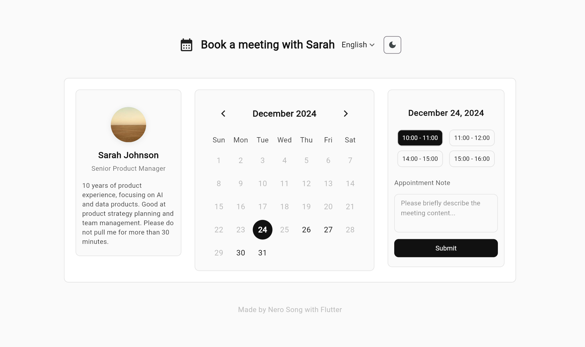
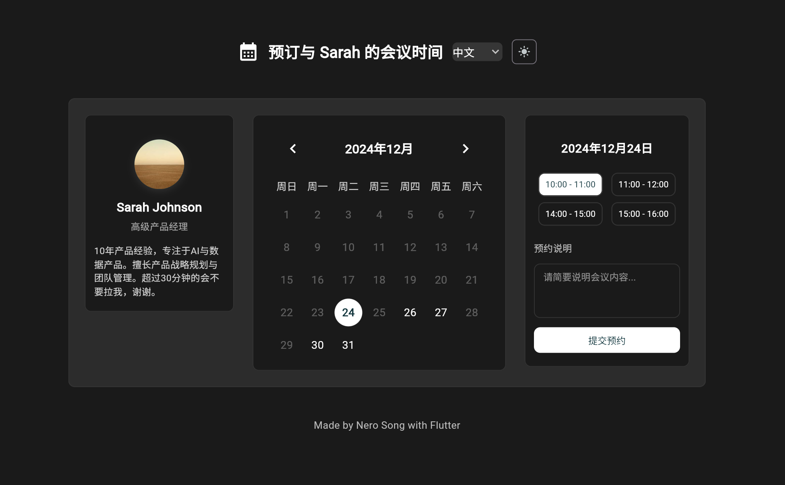

# NS Appointment Calendar

A beautiful and modern appointment calendar widget Demo built with Flutter. Perfect for scheduling meetings, consultations, or any time-based appointments.




Live Demo(This project on Web): [https://ns-appointment-calendar.zeabur.app/](https://ns-appointment-calendar.zeabur.app/)

English | [简体中文](README_zh.md)

## Features

- Modern and elegant UI design
- Light/Dark mode support
- Internationalization (English/Chinese)
- Flexible date selection
- Customizable time slots
- Weekend and holiday blocking
- Appointment notes
- Responsive layout (Mobile/Desktop)

## Getting Started

> ⚠️ Note: This package is not yet published to pub.dev. For now, you can copy the `calendar.dart` file from this repository and use it directly in your project.

### Usage

1. Copy the `calendar.dart` file from this repository to your project.

2. Import and use the widget:

```dart
AppointmentCalendar(
  name: 'Sarah Johnson',
  title: 'Senior Product Manager',
  avatarImg: NetworkImage('https://example.com/avatar.jpg'),
  description: 'Product strategy and team management expert',
  disabledDays: {
    DateTime(2024, 12, 25), // Christmas
    DateTime(2025, 1, 1),   // New Year
  },
  timeSlots: const [
    '10:00 - 11:00',
    '11:00 - 12:00',
    '14:00 - 15:00',
    '15:00 - 16:00',
  ],
  onSubmit: (date, timeSlot, note) {
    print('Appointment submitted: $date, $timeSlot, $note');
  },
),
```

## Customization

The widget is highly customizable with theme support. You can customize by parameters or just edit the source code:

- Colors and styles
- Time slots
- Disabled dates
- Text strings
- Layout and spacing

## License

This project is licensed under the MIT License - see the [LICENSE](LICENSE) file for details.
