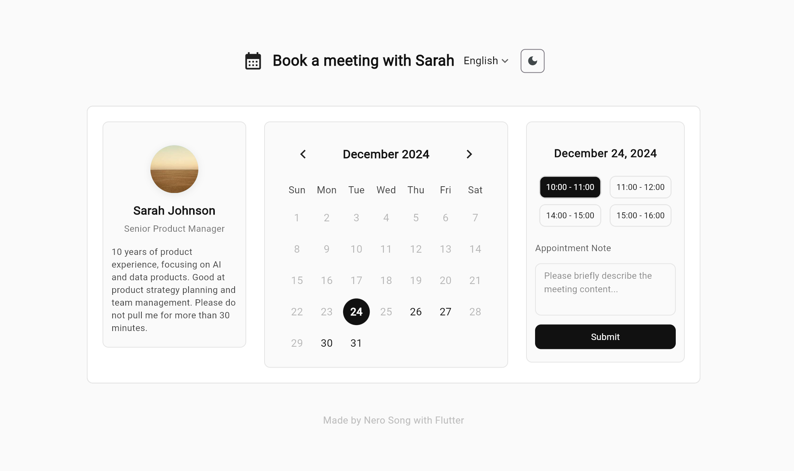
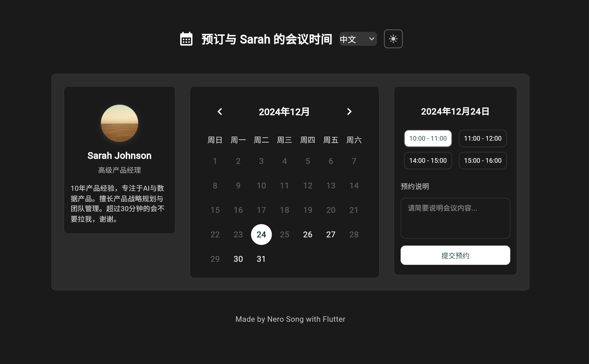

# NS Appointment Calendar

Flutter 写的现代预约日历组件 Demo。适用于会议安排、咨询预约或任何基于时间的预约场景。




在线演示（Web 版）：[https://ns-appointment-calendar.zeabur.app/](https://ns-appointment-calendar.zeabur.app/)

[English](README.md) | 简体中文

## 功能特点

- 现代简约的界面设计
- 支持浅色/深色主题
- 中英文国际化支持
- 灵活的日期选择
- 可自定义时间段
- 周末和节假日禁用
- 预约备注功能
- 响应式布局（移动端/桌面端）

## 开始使用

> ⚠️ 注意：太简单了还没有发布到 pub.dev 上。可以直接从仓库复制 `calendar.dart` 文件到你的项目中使用。

### 使用方法

1. 将仓库中的 `calendar.dart` 文件复制到你的项目中。

2. 导入并使用组件：

```dart
AppointmentCalendar(
  name: '张三',
  title: '高级产品经理',
  avatarImg: NetworkImage('https://example.com/avatar.jpg'),
  description: '产品战略和团队管理专家',
  disabledDays: {
    DateTime(2024, 12, 25), // 圣诞节
    DateTime(2025, 1, 1),   // 元旦
  },
  timeSlots: const [
    '10:00 - 11:00',
    '11:00 - 12:00',
    '14:00 - 15:00',
    '15:00 - 16:00',
  ],
  onSubmit: (date, timeSlot, note) {
    print('预约已提交：$date, $timeSlot, $note');
  },
),
```

## 自定义选项

组件支持高度自定义，你可以通过参数或直接编辑源码来自定义：

- 颜色和样式
- 时间段
- 禁用日期
- 文本内容
- 布局和间距

## 许可证

本项目基于 MIT 许可证开源 - 详见 [LICENSE](LICENSE) 文件。
